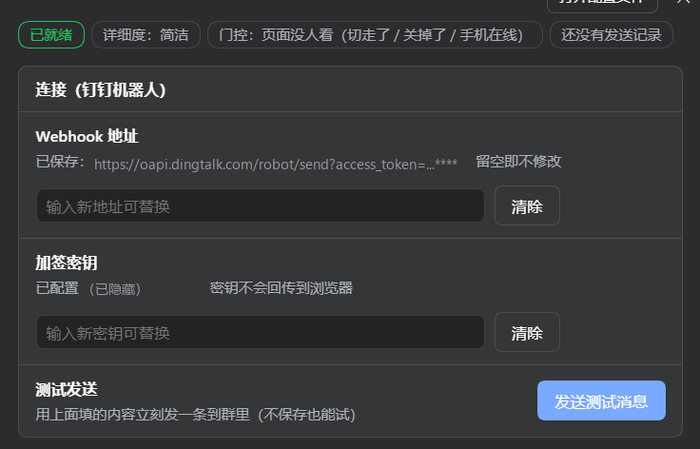
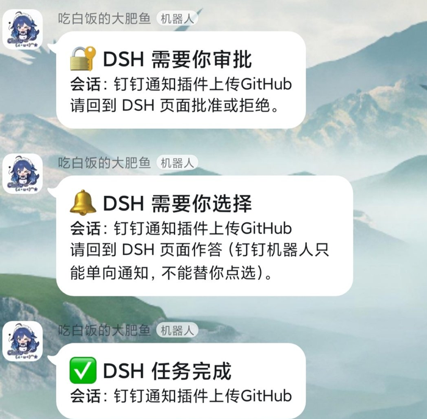
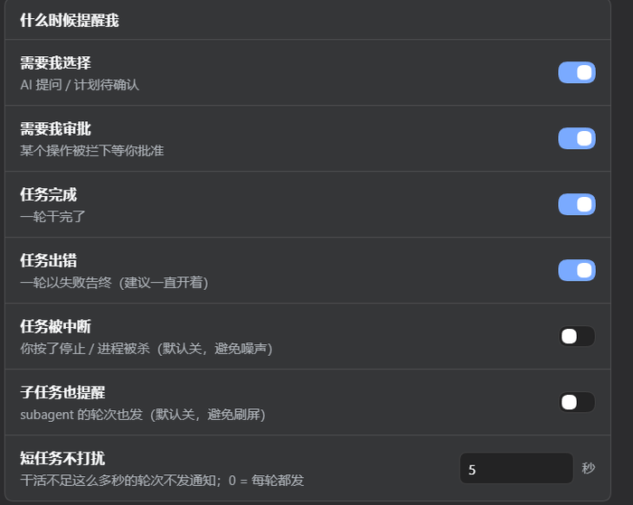
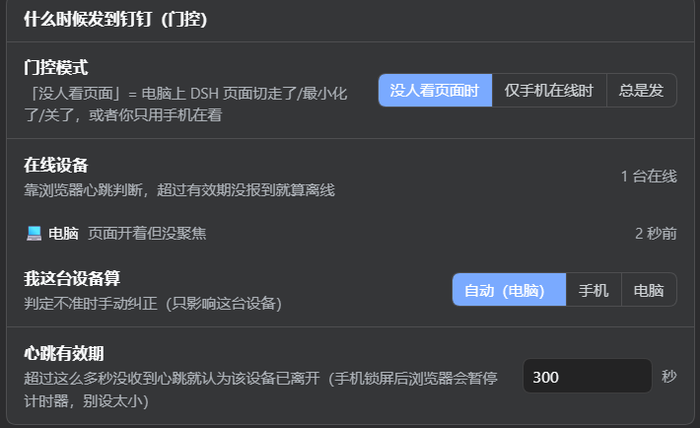
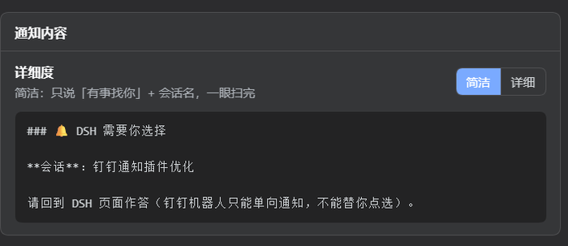
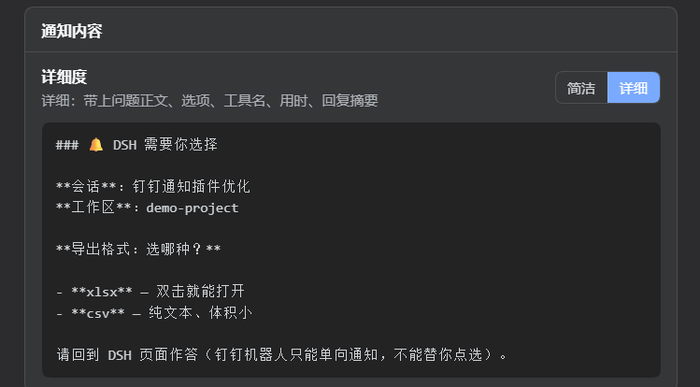
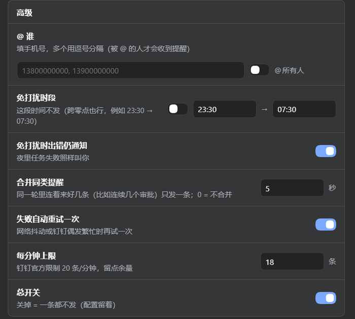

# 钉钉通知 · dsh-dingtalk-notify

**中文** | [English](README.en.md)

一个 [DSH](https://github.com/deepseek-ai) 插件：**AI 需要你拍板、或一轮活干完了，往你的钉钉群推一条消息**，并附带一个装在 DSH 设置里的控制面板。

> 钉钉自定义机器人只能发不能收，所以通知里写的是「请回到 DSH 页面操作」。

## 安装

### 网页版（命令行 / `dsh web`）

```powershell
dsh plugin --profile web add github:LapStdy/dsh-dingtalk-notify
```

装完**重启 `dsh web`**（面板在启动时扫描名册），然后打开 **设置 → 钉钉通知**。

### 桌面端（DeepSeek Harness 应用）

桌面端的配置由应用自己独占管理，**命令行装不了**（`dsh plugin --profile desktop ...` 会直接报 `managed exclusively by the Electron application`）。要在应用界面里装：

1. 左侧栏点 **插件**
2. 点 **添加插件**
3. 粘贴 `github:LapStdy/dsh-dingtalk-notify`（也可以粘完整地址 `https://github.com/LapStdy/dsh-dingtalk-notify`），点安装
4. 装完**重启桌面端**，再打开 **设置 → 钉钉通知**

> 想改代码就先 `git clone https://github.com/LapStdy/dsh-dingtalk-notify.git`，再 `dsh plugin --profile web add "<克隆下来的目录>"`。
> 本插件是纯 JS、无构建步骤，从 GitHub 安装**不需要**额外的构建授权。

配置放在 `~/.dsh/dingtalk-notify/config.json`，**面板保存或手改文件都即时生效，不用重启**。

**运行要求**：DSH ≥ `0.1.5-rc.1`，Node ≥ 18。

## 教程：怎么让它真的发到钉钉群

装好插件只是一半，**消息发不发得出去，取决于钉钉那边的机器人怎么建**。照下面走一遍，大约 5 分钟。

### 第 1 步 · 在钉钉群里加一个机器人

1. 打开钉钉，进你想收通知的群（没有就新建一个，只有你自己的群也行）
2. 右上角 **群设置**（⋯）→ **机器人** → **添加机器人** → **自定义（通过 Webhook 接入）**
3. 起个名字（比如「DSH 通知」），点下一步

### 第 2 步 · 选安全设置（**这一步决定能不能发成功**）

二选一：

| 选哪种 | 怎么做 | 要注意 |
|---|---|---|
| **加签**（推荐） | 复制那串 `SEC` 开头的密钥 | 密钥要填进 DSH；换了机器人得重新复制 |
| **自定义关键词** | 填一个关键词，比如 `DSH` | 钉钉只放行**正文里含这个词**的消息；本插件标题固定带 `DSH`，所以填 `DSH` 一定过 |

勾选同意 → 完成 → **复制 Webhook 地址**（形如 `https://oapi.dingtalk.com/robot/send?access_token=...`）。

> ⚠️ Webhook 地址 + 加签密钥 = 你在这个群里的发帖凭据。别贴给别人，更别提交到 GitHub。

### 第 3 步 · 填进 DSH 并测通

打开 **设置 → 钉钉通知**：



1. **Webhook 地址**：粘贴第 2 步复制的地址（原来那条只显示尾巴，直接粘新的就会替换）
2. **加签密钥**：用加签模式就粘 `SEC...`；用关键词模式留空
3. 点 **发送测试消息** —— 这一下**不受门控限制，永远真发**

群里收到，链路就通了。

### 第 4 步 · 群里收到就是这样



### 第 5 步 · 没收到？按这个顺序查

| 现象 | 说明 |
|---|---|
| 面板提示 **发送失败 `310000`** | 关键词或加签不匹配，最常见的坑。改成「自定义关键词」并填 `DSH` 最省事 |
| 面板提示 **已跳过** | 这不是失败：当时有人正看着 DSH 页面 / 手机不在线 / 处在免打扰时段。点「发送测试消息」可绕过门控单独验证链路 |
| 面板提示 **还没填 Webhook** | 地址没存上，回第 3 步重来 |
| 钉钉里没人被 @ | 机器人只会往群里发消息，要 @ 谁得在「高级」里填手机号 |
| 只有完成通知、没有选择通知 | 那个问题可能被 `dsh-auto-review` 之类的回答者直接接走了，诊断区里有记录 |

## 会推什么

| 时机 | 钉钉里收到 |
|---|---|
| AI 让你选择（含计划审批） | 🔔 DSH 需要你选择 |
| 某个操作被拦下要你批准 | 🔐 DSH 需要你审批 |
| 一轮任务结束 | ✅ 任务完成 / ❌ 出错 / ⏹ 已中断 |

每一项都能单独关掉。默认「干活不足 5 秒的轮次不发」，避免刷屏。

插件只**旁观**、不抢答：发完通知立刻放行，弹窗和自动审批照旧工作；发送失败只写日志，绝不影响 AI 干活。



## 什么时候才发（门控）

每个打开的 DSH 页面每 45 秒报到一次，宿主持有一张在线设备表：

| 模式 | 行为 |
|---|---|
| `away`（默认） | 有人正看着 DSH 页面就不发；人走开、或只有手机在看时才发 |
| `mobileOnly` | 只有手机端在线时才发，否则静默 |
| `always` | 总是发 |

手机浏览器锁屏后会暂停计时器、心跳会断，所以心跳有效期默认 5 分钟。想要「离开电脑才通知我」，用 `away` 更可靠。



## 通知长什么样（详细度）

面板里二选一，右下方就是实时预览：

| 简洁 | 详细 |
|---|---|
|  |  |

**简洁**只发一句话 + 会话名，一眼扫完；**详细**会带上问题正文、选项、工具名、用时和回复摘要。

## 配置项

`~/.dsh/dingtalk-notify/config.json`，首次启动自动生成模板：

| 键 | 默认 | 说明 |
|---|---|---|
| `enabled` | `true` | 总开关 |
| `webhook` | `""` | 机器人 Webhook 地址（必填） |
| `secret` | `""` | 加签密钥 `SECxxx`；用「自定义关键词」模式则留空 |
| `detailLevel` | `detailed` | `brief` 简洁（一句话）/ `detailed` 详细（问题正文、选项、工具名、用时） |
| `gating` | `away` | `away` / `mobileOnly` / `always` |
| `presenceTtlSeconds` | `300` | 心跳有效期（60–3600 秒） |
| `notifyOnQuestion` | `true` | 需要你选择时通知 |
| `notifyOnApproval` | `true` | 需要你审批时通知 |
| `notifyOnTurnEnd` | `true` | 任务完成时通知 |
| `notifyOnError` | `true` | 轮次失败时通知 |
| `notifyOnAbort` | `false` | 轮次被中断时通知 |
| `minTurnSeconds` | `5` | 短于此秒数的轮次不发；`0` = 每轮都发 |
| `includeSubagents` | `false` | 子任务的轮次也发 |
| `atMobiles` | `[]` | 要 @ 的手机号（正文会自动补 `@手机号` 文本，否则钉钉不会真的 @） |
| `atAll` | `false` | @ 所有人 |
| `dndEnabled` | `false` | 免打扰时段开关 |
| `dndFrom` / `dndTo` | `23:30` / `07:30` | 免打扰区间，可跨零点 |
| `dndExceptErrors` | `true` | 免打扰时段内出错仍通知 |
| `mergeWindowSeconds` | `3` | 同一轮同类提醒合并窗口；`0` = 不合并 |
| `retryOnFail` | `true` | 失败自动重试一次；被限流则冷却 60 秒 |
| `maxMessagesPerMinute` | `18` | 每分钟上限（钉钉官方 20） |

发送诊断日志：`~/.dsh/dingtalk-notify/log.ndjson`，每行一条 JSON（`sent` / `skip` / `error`）。面板的「诊断」区也能看最近 20 条决策和跳过原因。



## 面板接口（宿主侧）

| 方法 | 路径 | 说明 |
|---|---|---|
| GET | `/api/dsh-dingtalk-notify/config` | 读脱敏配置 + 当前门控判定 |
| POST | `/api/dsh-dingtalk-notify/config` | 写配置（`null` 表示清除该键） |
| POST | `/api/dsh-dingtalk-notify/test` | 发一条测试消息 |
| POST | `/api/dsh-dingtalk-notify/presence` | 设备心跳 |
| GET | `/api/dsh-dingtalk-notify/status` | 在线设备 + 发送历史 |
| POST | `/api/dsh-dingtalk-notify/log` | `{action:"clear"}` 清空内存历史 |

除 `presence` 外均为**仅回环**可访问；`presence` 只写在线表、不读配置。加签密钥**永不回传浏览器**，只显示是否已配置。

## 自检

```powershell
node bin/selftest.mjs         # 配置读写 / 掩码 / 门控 / 消息组装 / 浏览器半区，不发消息
node bin/smoke-test.mjs --dry # 桩上下文加载插件，验监听器与面板接口
node bin/dingtalk-test.mjs    # 真发一条自检消息到群里
```

## 卸载 / 临时停用

```powershell
dsh plugin --profile web remove dsh-dingtalk-notify
```

临时安静：面板关「总开关」，或把 `config.json` 的 `enabled` 改成 `false`。

改了 `lib/` 下任何文件（宿主半区 `index.js`、浏览器半区 `client.js`）都要**重启 `dsh web`** 才生效——运行中的进程不重载插件源码。

## 排障

| 现象 | 原因 |
|---|---|
| 设置里没有「钉钉通知」 | 没重启 `dsh web`；面板名册在启动时扫描 |
| 钉钉没收到，面板显示「已跳过」 | 看跳过原因：有人正看着页面 / 手机不在线 / 免打扰 / 没填 Webhook |
| 面板显示「发送失败」 | 错误码已翻译成人话；`310000` = 关键词或加签不匹配 |
| 只有完成通知、没有选择通知 | 问题可能被 `dsh-auto-review` 之类的回答者直接接走了，诊断区有记录 |

## 更新日志

见 [CHANGELOG.md](CHANGELOG.md)。

## 许可

MIT
